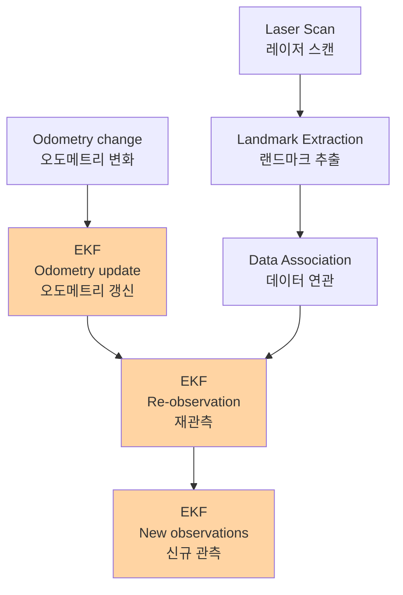
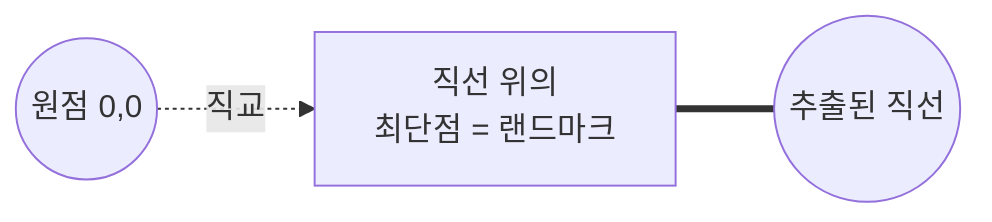

# SLAM for Dummies

> [!abstract] 부제목
> **A Tutorial Approach to Simultaneous Localization and Mapping**
> 동시적 위치 추정 및 지도 작성에 대한 튜토리얼 접근
>
> By the 'dummies' — Søren Riisgaard and Morten Rufus Blas

---

## 1. 목차

1. [[#1. 목차|목차]]
2. [[#2. 서론|서론]]
3. [[#3. SLAM이란|SLAM이란]]
4. [[#4. 하드웨어|하드웨어]]
5. [[#5. SLAM 프로세스|SLAM 프로세스]]
6. [[#6. 레이저 데이터|레이저 데이터]]
7. [[#7. 오도메트리 데이터|오도메트리 데이터]]
8. [[#8. 랜드마크|랜드마크]]
9. [[#9. 랜드마크 추출|랜드마크 추출]]
10. [[#10. 데이터 연관|데이터 연관]]
11. [[#11. EKF (확장 칼만 필터)|EKF (확장 칼만 필터)]]
12. [[#12. 마치며|마치며]]
13. [[#13. 참고문헌|참고문헌]]
14. [[#14. 부록 A: 좌표 변환|부록 A: 좌표 변환]]
15. [[#15. 부록 B, C, D 코드 부록|부록 B, C, D — 코드 부록]]

---

## 2. 서론

이 문서의 목적은 이동 로봇을 위한 **SLAM**(Simultaneous Localization And Mapping, 동시적 위치 추정 및 지도 작성) 분야에 대한 튜토리얼 형식의 입문을 제공하는 것이다. 관련 논문은 무수히 많지만, 이 분야에 처음 입문하는 사람이 SLAM 구현에 얽힌 여러 미묘한 부분들을 이해하려면 수많은 시간의 자료 조사가 필요하다. 따라서 본 문서는 가능한 한 명확하고 간결하게 주제를 다루면서, 이해에 필요한 사전 지식은 최소한으로 유지하고자 한다. 실제로 이 문서를 읽은 후 자리에 앉아 기본적인 SLAM을 구현할 수 있을 정도가 되어야 한다.

SLAM은 여러 가지 방식으로 구현될 수 있다. 우선 사용할 수 있는 하드웨어가 매우 다양하다. 둘째, SLAM은 단일 알고리즘이라기보다 하나의 **개념(concept)** 에 가깝다. SLAM에는 여러 단계가 있고, 각 단계는 다양한 알고리즘으로 구현될 수 있다. 대부분의 경우 본 문서에서는 단일 접근법을 설명하지만, 추가 학습을 위해 다른 가능한 방법들도 언급한다.

이 문서를 작성한 동기는 우선 우리 자신이 SLAM을 더 잘 이해하기 위함이다. **남에게 가르치면서 자신도 더 잘 알게 된다.** 둘째, 기존 SLAM 논문들은 대부분 매우 이론적이고 SLAM의 좁은 영역에서의 혁신에 집중되어 있다. 본 문서의 목적은 매우 실용적이고, SLAM을 더 잘 알기 위한 출발점이 될 수 있는 **단순하고 기본적인 SLAM 알고리즘**에 초점을 맞추는 것이다. 어느 정도 SLAM 배경 지식이 있는 사람들을 위해 **EKF(Extended Kalman Filter, 확장 칼만 필터)** 기반의 완전한 SLAM 솔루션을 제시한다. 여기서 "완전하다"는 것은 "완벽하다"는 의미가 아니라, 구현을 작동시키기 위한 **모든 기본 단계를 다룬다**는 의미이다. 또한 SLAM이 완전히 해결된 문제가 아니며, 여전히 활발한 연구가 진행 중이라는 점을 밝혀둔다.

> [!info] 코드 제공
> 시작을 쉽게 하기 위해 모든 코드가 제공되어 있다. 다운로드, 컴파일, 하드웨어(SICK 레이저 스캐너, ER1 로봇) 연결 후 실행만 하면 되는 **Plug-and-Play** 방식이다. 코드는 Microsoft Visual C#으로 작성되었으며 .Net Framework v1.1에서 컴파일된다. 대부분의 코드가 매우 직관적이어서 의사 코드처럼 읽힐 수 있으므로 다른 언어/플랫폼으로의 포팅도 쉬울 것이다.

---

## 3. SLAM이란

**SLAM**은 앞서 언급했듯 Simultaneous Localization And Mapping의 약자이다. 원래 Smith, Self, Cheeseman[^6]의 선행 연구를 기반으로 Hugh Durrant-Whyte와 John J. Leonard[^7]가 개발했다. Durrant-Whyte와 Leonard는 처음에 이를 **SMAL**이라 명명했으나, 더 좋은 인상을 주기 위해 나중에 SLAM으로 바꾸었다. SLAM은 **이동 로봇이 미지의 환경에서 지도를 작성하는 동시에 그 지도를 이용해 환경을 항행(navigate)하는 문제**를 다룬다.

SLAM은 여러 부분으로 구성된다:

- 랜드마크 추출 (Landmark Extraction)
- 데이터 연관 (Data Association)
- 상태 추정 (State Estimation)
- 상태 갱신 (State Update)
- 랜드마크 갱신 (Landmark Update)

각각의 작은 부분을 해결하는 방법은 다양하다. 본 문서에서는 각 부분의 예시를 보여주며, 이는 곧 일부를 새로운 방식으로 교체할 수 있음을 의미한다. 예를 들어 [[#9. 랜드마크 추출|랜드마크 추출]] 문제는 두 가지 다른 방법으로 해결한다. 본 구현을 그대로 사용하고 자신만의 새로운 접근법으로 확장하는 것을 권장한다. 우리는 **실내 환경의 이동 로봇**에 초점을 맞추기로 결정했다. 다른 환경에서 사용하기 위해 일부 알고리즘을 변경할 수도 있다.

SLAM은 2D 및 3D 운동 모두에 적용 가능하다. 본 문서에서는 **2D 운동만** 다룬다.

> [!tip] 사전 지식
> 본 튜토리얼을 보다 쉽게 이해하려면 SLAM의 개념과 EKF에 대한 입문적 이해가 있는 것이 좋다. 강력히 요구되는 것은 아니지만, 배경 지식이 있으면 훨씬 수월하다.

---

## 4. 하드웨어

로봇의 하드웨어는 매우 중요하다. SLAM을 수행하려면 **이동 로봇**과 **거리 측정 장치**가 필요하다. 본 문서에서 다루는 이동 로봇은 바퀴로 움직이는 실내 로봇이다. 본 문서는 주로 SLAM의 소프트웨어 구현에 초점을 맞추므로, 휴머노이드, 자율 수중 차량, 자율 비행체, 특이한 바퀴 구성을 가진 로봇 등 복잡한 운동 모델을 가진 로봇은 다루지 않는다.

### 로봇

고려해야 할 주요 요소는 **사용 편의성, 오도메트리 성능, 가격**이다. 오도메트리 성능이란 바퀴의 회전만으로 로봇이 자신의 위치를 얼마나 잘 추정할 수 있는지를 나타낸다.

> [!warning] 오도메트리 정확도 기준
> 로봇의 오차는 **이동 1m당 2cm 이내**, **회전 45°당 2° 이내**여야 한다. 일반적인 로봇 드라이버는 직교 좌표계 상의 (x, y) 위치와 현재 방향(bearing/heading)을 보고할 수 있어야 한다.

로봇을 처음부터 직접 제작할 수도 있다. 시간이 많이 걸리지만 학습 경험이 된다. 또는 Real World Interface나 Evolution Robotics의 **ER1** 로봇[^10]처럼 완제품을 구매할 수도 있다. RW1은 더 이상 판매되지 않지만 여전히 많은 컴퓨터 과학 연구실에 있다. 다만 RW1은 **오도메트리가 악명 높게 나쁘다.** 이는 현재 위치 추정 문제를 가중시켜 SLAM을 훨씬 어렵게 만든다. 우리는 ER1을 사용했다. 작고 매우 저렴하다 (학술용 $200, 개인용 $300). 카메라와 로봇 제어 시스템이 함께 제공된다. 매우 기본적인 드라이버를 부록 및 웹사이트에 제공해두었다.

### 거리 측정 장치

오늘날 거리 측정 장치는 일반적으로 **레이저 스캐너**가 사용된다. 매우 정밀하고 효율적이며 출력 처리에 많은 연산이 필요하지 않다. 단점은 매우 비싸다는 것 — SICK 스캐너는 약 $5,000 한다. 또한 유리 같은 특정 표면에서는 매우 나쁜 측정값(data output)을 낸다는 문제가 있다. 수중에서는 빛이 물에 의해 산란되어 거리가 급격히 줄어들므로 사용할 수 없다.

두 번째 선택지는 **소나(Sonar)** 이다. 수년 전 집중적으로 사용되었고 레이저 스캐너에 비해 매우 저렴하지만 측정 품질이 떨어진다. 레이저 스캐너가 0.25° 정도의 매우 좁은 단일 직선 빔을 가지는 데 비해, 소나는 폭 30°에 이르는 빔을 쉽게 가진다. 하지만 **수중에서는 소나가 최선의 선택**이며, 돌고래의 항행 방식과 닮았다. 흔히 Polaroid 소나가 사용되는데, 원래 폴라로이드 카메라의 사진 촬영 시 거리 측정용으로 개발된 것이다. 소나는 [^7]에서 성공적으로 사용된 바 있다.

세 번째는 **비전(Vision)** 이다. 전통적으로 연산량이 많고 빛 변화에 취약했다. 빛이 없는 방에서는 비전 시스템은 거의 작동하지 않는다. 그러나 최근 몇 년간 이 분야에서 흥미로운 진보가 있었다. 흔히 **스테레오(stereo)** 또는 **트라이클롭스(triclops)** 시스템으로 거리를 측정한다. 비전을 사용하는 것은 인간이 세상을 보는 방식과 닮아 직관적으로 더 매력적일 수 있다. 또한 영상에는 레이저/소나 스캔보다 훨씬 많은 정보가 담겨 있다. 과거에는 이 모든 데이터를 처리해야 한다는 점이 병목이었지만, 알고리즘과 연산력의 발전으로 점차 문제가 줄어들고 있다. 비전 기반 거리 측정은 [^8]에서 성공적으로 사용되었다.

우리는 SICK 사의 레이저 거리 측정기[^9]를 사용하기로 했다. 매우 널리 사용되고, 눈에 위험하지 않으며, SLAM에 좋은 특성을 가진다. 측정 오차는 **±50mm**로 커 보이지만 실제로는 훨씬 작았다. 최신 SICK 레이저 스캐너는 오차가 **±5mm**까지 줄어들었다.

---

## 5. SLAM 프로세스

SLAM 프로세스는 여러 단계로 구성된다. 목표는 **환경 정보를 이용해 로봇의 위치를 갱신**하는 것이다. 로봇의 오도메트리(로봇 위치 정보)는 종종 부정확하므로 오도메트리에만 의존할 수 없다. 대신 환경의 레이저 스캔을 이용해 로봇 위치를 보정한다. 이는 환경에서 **특징(feature)** 을 추출하고, 로봇이 이동할 때 이를 **재관측(re-observe)** 함으로써 이루어진다. SLAM 프로세스의 핵심은 **EKF(확장 칼만 필터)** 이다. EKF는 이러한 특징들을 기반으로 로봇이 자신이 어디에 있다고 생각하는지를 갱신하는 역할을 한다. 이러한 특징은 일반적으로 **랜드마크(landmark)** 라고 불리며, 다음 장에서 EKF와 함께 설명한다. EKF는 로봇 위치의 불확실성 및 환경에서 본 랜드마크의 불확실성에 대한 추정치를 유지한다.


*그림 1. SLAM 프로세스 개요*

로봇이 이동하면 오도메트리가 변하므로, EKF에서 **오도메트리 갱신**으로 로봇의 새 위치에 대한 불확실성이 갱신된다. 그 다음 새 위치에서 환경의 랜드마크들이 추출된다. 로봇은 이 랜드마크들을 **이전에 본 랜드마크 관측치들과 연관(associate)** 짓는다. **재관측된** 랜드마크는 EKF에서 로봇 위치를 갱신하는 데 사용된다. 이전에 본 적 없는 랜드마크는 **새 관측치**로 EKF에 추가되어 추후 재관측이 가능해진다.

> [!note] 핵심 통찰
> 이러한 단계의 **어느 시점에서도 EKF는 로봇의 현재 위치 추정치를 가지고 있다**. 즉 SLAM은 단발적인 계산이 아니라 끊임없이 추정치를 갱신해 나가는 **재귀적 프로세스**다.

### 도식으로 보는 SLAM 프로세스

> [!example]+ 그림 2~6 요약
> - **그림 2**: 로봇(삼각형)이 센서로 랜드마크(별표) 위치를 측정 (번개 모양이 센서 측정)
> - **그림 3**: 로봇이 이동. 이동 거리는 오도메트리로 측정 → 로봇은 "여기에 있을 것"이라 생각
> - **그림 4**: 로봇이 다시 센서로 랜드마크를 측정하나, 자신이 생각한 위치 기준으로 예상한 위치와 일치하지 않음 → **로봇은 자신이 생각한 위치에 있지 않다**
> - **그림 5**: 로봇은 오도메트리보다 **센서를 더 신뢰**하므로, 랜드마크의 실제 위치 정보를 사용해 자신의 위치를 결정 (원래 생각한 위치는 점선 삼각형)
> - **그림 6**: 실제 로봇 위치. 센서가 완벽하지 않으므로 정확하지는 않지만, **오도메트리에만 의존하는 것보다는 낫다**
>   - 점선 삼각형: 추정 위치
>   - 파선 삼각형: 오도메트리가 말한 위치
>   - 마지막 삼각형: 실제 위치

---

## 6. 레이저 데이터

SLAM 프로세스의 첫 번째 단계는 **로봇 주변 환경에 대한 데이터 획득**이다. 우리는 레이저 스캐너를 사용하기로 했으므로 레이저 데이터를 얻는다. 사용하는 SICK 레이저 스캐너는 100° 또는 180°의 각도에서 거리 측정값을 출력할 수 있다. 수직 분해능은 0.25°, 0.5°, 1.0° 중 선택 가능 — 이는 레이저 빔이 측정하는 영역의 폭을 의미한다.

일반적인 레이저 스캐너 출력 예시:

```
2.98, 2.99, 3.00, 3.01, 3.00, 3.49, 3.50, ...., 2.20, 8.17, 2.21
```

출력은 **오른쪽에서 왼쪽**으로의 거리(미터)를 나타낸다. 특정 각도에서 정확한 거리를 측정할 수 없는 경우 높은 값이 반환된다. 본 구현에서는 **8.1을 오류 임계값**으로 사용한다 (일부 스캐너는 8.1m 이상의 거리도 측정 가능하도록 설정 가능).

> [!info] 레이저 스캐너 속도
> 레이저 스캐너는 매우 빠르다. 직렬 포트로 약 **11 Hz**로 조회 가능하다.

레이저 스캐너 인터페이스 코드는 [[#15. 부록 B, C, D 코드 부록|부록 B: SICK LMS 200 인터페이스 코드]]를 참고.

---

## 7. 오도메트리 데이터

SLAM의 중요한 측면 중 하나가 **오도메트리 데이터**다. 오도메트리 데이터의 목적은 로봇 바퀴의 움직임으로 측정한 **로봇의 대략적인 위치**를 제공하는 것이며, 이는 EKF에서 로봇이 어디에 있을지에 대한 **초기 추정치(initial guess)** 역할을 한다.

ER1 로봇에서 오도메트리 데이터를 얻는 것은 내장 텔넷 서버를 사용하면 매우 쉽다. 특정 포트의 텔넷 서버에 문자열을 보내면 서버가 응답을 반환한다.

> [!warning] 타이밍 이슈
> 오도메트리 데이터와 레이저 데이터의 **타이밍을 맞추는 것**이 어려운 부분이다. 시각 $t$의 레이저 데이터는 오도메트리 데이터가 나중에 검색되면 이미 낡은 데이터가 된다. 동시에 유효하도록 만들려면 데이터를 **외삽(extrapolate)** 한다. 제어값을 알고 있으므로 **오도메트리를 외삽하는 것이 가장 쉽다.** 레이저 측정값을 예측하는 것은 매우 어려울 수 있다. 측정 반환 시점을 제어할 수 있다면 레이저와 오도메트리를 **동시에 요청**하는 것이 최선이다.

ER1 로봇 인터페이스 코드는 [[#15. 부록 B, C, D 코드 부록|부록 C: ER1 인터페이스 코드]] 참고.

---

## 8. 랜드마크

**랜드마크(Landmark)** 는 환경에서 쉽게 재관측되고 구별될 수 있는 **특징(feature)** 이다. 로봇은 이를 통해 자신의 위치를 파악(자기 위치 추정, **localize**) 한다.

> [!quote] 비유
> 로봇 입장에서 이것이 어떻게 작동하는지 상상하는 한 가지 방법은 **눈을 가린 자신**을 그려보는 것이다. 눈을 가린 채 집안을 돌아다닐 때, 길을 잃지 않기 위해 손을 뻗어 물체를 만지거나 벽을 더듬을 수 있다. 문틀을 만지는 특징적인 느낌은 자신이 어디 있는지 추정하는 데 도움을 준다. **소나와 레이저 스캐너가 곧 로봇의 촉각**이다.

### 다양한 환경의 좋은 랜드마크 예시

- **그림 7 — 자유의 여신상**: 독특하고 육지, 바다, 공중 다양한 위치에서 잘 보이므로 좋은 랜드마크
- **그림 8 — 부두의 나무 기둥**: 수중 차량에 좋은 랜드마크
- **그림 9 — 실내 환경**: 직선과 잘 정의된 모서리가 많아 랜드마크로 사용 가능

랜드마크 종류는 **로봇이 동작하는 환경에 따라 달라진다.**

### 좋은 랜드마크의 조건

> [!success] 좋은 랜드마크의 핵심 요건
> 1. **재관측 가능(Re-observable)** — 다양한 위치 및 각도에서 검출 가능해야 한다.
> 2. **구별 가능(Distinguishable)** — 각 랜드마크는 서로 쉽게 구별되어야 한다. 두 랜드마크가 매우 가까이 있으면 어려울 수 있다.
> 3. **풍부함(Plentiful)** — 환경 내에 충분히 많이 있어야 한다. 그렇지 않으면 로봇이 가시 랜드마크 없이 오래 머물러 길을 잃을 수 있다.
> 4. **정지(Stationary)** — 사람을 랜드마크로 쓰는 것은 나쁜 생각. 랜드마크가 항상 같은 자리에 있지 않다면, 그 랜드마크로 어떻게 자신의 위치를 알 수 있겠는가?

---

## 9. 랜드마크 추출

로봇이 사용할 랜드마크가 결정되면, 이를 **로봇의 감각 입력에서 안정적으로 추출**해야 한다.

랜드마크 추출 방법은 다양하며, **추출하려는 랜드마크 종류** 및 **사용하는 센서**에 크게 의존한다.

본 문서에서는 레이저 스캐너 기반의 기본 알고리즘 두 가지를 제시한다:
1. **Spikes** (스파이크)
2. **RANSAC** (Random Sampling Consensus, 무작위 표본 합의)

### 스파이크 랜드마크 (Spike Landmarks)

스파이크 랜드마크 추출은 **극값(extrema)** 을 이용한다. 레이저 스캔의 인접한 두 측정값의 차이가 일정 임계치(예: 0.5m) 이상인 지점을 찾는다. 이는 예컨대 일부 레이저 빔이 벽에 반사되고 일부는 벽을 지나쳐 더 멀리 있는 것에 반사되는 경우의 큰 변화를 포착한다.

- **그림 10**: 스파이크 랜드마크. 빨간 점들은 랜드마크로 추출된 **탁자 다리**들이다.

더 나은 방식은 인접한 세 값 A, B, C에 대해 (A - B) + (C - B) 를 계산하는 것이다. 이 값은 **실제 스파이크**를 찾는 데 더 좋으며, 단순한 영구적 거리 변화는 잡아내지 않는다.

> [!warning] 스파이크의 한계
> 스파이크 랜드마크는 두 레이저 빔 사이의 풍경이 크게 변하는 것에 의존한다. **부드러운 환경에서는 실패한다.**

### RANSAC (Random Sampling Consensus)

**RANSAC**은 레이저 스캔에서 **직선(line)** 을 추출하는 방법이다. 이 직선들은 랜드마크로 사용된다. 실내 환경에서는 직선이 자주 관측되는데, 이는 흔한 직선 벽의 특성이기 때문이다.

RANSAC의 작동 방식:
1. 레이저 측정값에서 **무작위로 표본을 추출**
2. **최소제곱법(least squares)** 으로 표본에 가장 잘 맞는 직선을 구함
3. 이 직선에 가까이 있는 레이저 측정값 개수를 셈
4. 그 개수가 임계치(**consensus**) 이상이면 직선(=벽 segment)을 봤다고 안전하게 가정

#### RANSAC 알고리즘 (180° 시야, 1° 분해능 가정)

> [!example]+ 알고리즘 의사 코드
> ```
> 다음을 만족하는 동안:
>   • 아직 연관되지 않은 레이저 측정값이 있고,
>   • 측정값 개수가 consensus보다 크고,
>   • 시도 횟수가 N 미만일 때
> do
>   - 무작위로 레이저 측정값 하나 선택
>   - 그 측정값 주변 D도 이내에서 S개의 표본 추출
>     (예: 무작위 측정값으로부터 10° 이내에서 5개 표본)
>   - 이 S개 표본과 원래 측정값으로 최소제곱 최적 직선 계산
>   - 이 직선으로부터 X cm 이내에 있는 측정값 개수 결정
>   - 직선 위 측정값 개수 ≥ consensus C이면:
>       o 직선 위에 있다고 판단된 모든 측정값으로 새로운 최소제곱 직선 재계산
>       o 이 직선을 추출된 직선들에 추가
>       o 직선 위 측정값을 미연관 측정값 집합에서 제거
> od
> ```

#### 튜닝 파라미터

| 기호 | 의미 |
|------|------|
| **N** | 직선 찾기 최대 시도 횟수 |
| **S** | 초기 직선 계산에 사용할 표본 수 |
| **D** | 초기 측정값으로부터 표본 추출 각도 범위 (도) |
| **X** | 직선과 측정값을 연관시키는 최대 거리 |
| **C** | 직선으로 인정하기 위한 최소 점 수 (consensus) |

#### 직선 → 점 변환

EKF 구현은 랜드마크가 로봇 위치 기준의 **거리(range)** 와 **방위(bearing)** 로 들어온다고 가정한다. 직선을 고정점으로 변환하려면, 세계 좌표의 어떤 고정점을 잡고 직선 위에서 그 고정점에 가장 가까운 점을 계산하면 된다.


*그림 11. 추출된 직선 랜드마크를 점으로 변환하는 방법 (원점을 고정점으로 사용)*

- **그림 12**: RANSAC이 레이저 스캔에서 주요 직선을 찾아낸다. 녹색 직선이 추출된 직선, 빨간 점이 점으로 근사된 랜드마크. RANSAC 파라미터를 바꾸면 작은 벽 segment도 추출 가능하지만, 신뢰성이 떨어지므로 사용하지 않았다. 또한 로봇 바로 위에 사람이 있는데도 **RANSAC은 레이저 스캔의 사람에 대해 강건(robust)** 하다.

> [!note] 추가 가능성
> EKF 구현을 점 대신 **직선**을 다룰 수 있도록 확장하는 것도 가능하나, 복잡하여 본 튜토리얼에서는 다루지 않는다.

### 다중 전략 (Multiple Strategies)

두 가지 다른 접근법을 제시했다. 둘 다 실내 환경에 적합하지만 추출하는 랜드마크의 종류가 다르다.

- **Spikes**: 단순하지만 **사람이 있는 환경에서 강건하지 않다.** 사람을 스파이크로 잡기 때문이다.
- **RANSAC**: 직선 추출이므로 **사람은 잡지 않는다.** 사람은 직선 형태를 갖지 않기 때문.
- **Scan-matching** (언급만): 연속된 두 레이저 스캔을 정합하는 또 다른 방법. 본 문서에서는 다루지 않음.

랜드마크 추출 알고리즘 코드는 [[#15. 부록 B, C, D 코드 부록|부록 D: 랜드마크 추출 코드]] 참고.

---

## 10. 데이터 연관

**데이터 연관(Data Association)** 문제는 **서로 다른 (레이저) 스캔에서 관측된 랜드마크들을 매칭**하는 문제이다. 이는 **랜드마크 재관측(re-observing)** 이라고도 한다.

> [!example] 비유로 이해하기
> 인간에게 의자를 랜드마크로 가정하자. 방에 있는 특정 의자를 봤다. 방을 나갔다가 나중에 다시 들어왔다. 그 의자를 보고 "아까 본 의자다"라고 말한다면, **데이터 연관**을 한 것이다.
>
> 단순해 보이지만 어려운 문제다. 만약 방에 거의 똑같은 의자가 두 개 있다면? 다시 돌아왔을 때 어느 것이 어느 것인지 정확히 구분하기 어렵다. 최선의 추측은 "왼쪽 것은 아까 왼쪽이었던 것, 오른쪽 것은 아까 오른쪽이었던 것"이다.

### 실무에서 발생 가능한 문제

> [!failure] 데이터 연관의 세 가지 문제
> 1. 매 시간 단계마다 랜드마크를 **재관측하지 못할 수 있음**
> 2. 어떤 것을 랜드마크로 관측했지만 **다시는 보지 못할 수 있음**
> 3. 랜드마크를 **이전 랜드마크와 잘못 연관(false association)** 시킬 수 있음

세 번째 문제(잘못된 연관)는 **치명적**이다. 로봇이 실제 위치와 완전히 다른 곳에 있다고 생각하게 만들기 때문이다.

### 데이터 연관 정책

다음과 같은 정책을 사용한다. 이전에 본 랜드마크를 저장하는 **데이터베이스**가 있다고 가정한다 (보통 초기에는 비어 있음).

> [!important] 핵심 규칙
> 어떤 랜드마크가 **N번 관측되기 전까지는** SLAM에 쓸만한 랜드마크로 간주하지 않는다. 이는 나쁜 랜드마크가 추출되는 경우를 제거한다.

#### 알고리즘 절차

1. **새 레이저 스캔**을 얻으면 랜드마크 추출로 모든 가시 랜드마크를 추출한다.
2. 각 추출된 랜드마크를 **데이터베이스에서 N번 이상 본 가장 가까운 랜드마크**와 연관시킨다.
3. 각 연관 쌍(추출된 랜드마크, DB의 랜드마크)을 **검증 게이트(validation gate)** 에 통과시킨다.
   - **a. 게이트 통과**: 동일한 랜드마크를 재관측한 것이므로 DB에서 관측 횟수를 1 증가시킨다.
   - **b. 게이트 실패**: 새 랜드마크로 DB에 추가하고 관측 횟수를 1로 설정한다.

이를 **최근접 이웃(nearest-neighbor) 접근법**이라 한다.

#### 거리 계산

가장 가까운 랜드마크를 계산하는 가장 단순한 방법은 **유클리디안 거리(Euclidean distance)** 이다. 다른 방법으로 **마할라노비스 거리(Mahalanobis distance)** 가 있는데 더 좋지만 더 복잡하다. 본 구현에서는 RANSAC 랜드마크가 보통 멀리 떨어져 있으므로 유클리디안 거리로도 충분하다.

#### 검증 게이트 (Validation Gate)

EKF 구현은 랜드마크 관측의 **불확실성에 대한 경계(bound)** 를 제공한다. 따라서 관측된 랜드마크가 DB의 랜드마크인지는 **불확실성 영역(error ellipse)** 안에 있는지를 확인함으로써 결정할 수 있다.

상수 $\lambda$를 설정하면, 관측된 랜드마크는 다음을 만족할 때 DB 랜드마크와 연관된다:

$$
v_i^T \, S_i^{-1} \, v_i \leq \lambda
$$

- $v_i$: **혁신값(innovation)** — [[#11. EKF (확장 칼만 필터)|EKF 챕터]] 참고
- $S_i$: **혁신 공분산(innovation covariance)** — EKF 챕터 참고

---

## 11. EKF (확장 칼만 필터)

**확장 칼만 필터(Extended Kalman Filter, EKF)** 는 **오도메트리 데이터**와 **랜드마크 관측치**로부터 로봇의 상태(위치)를 추정하는 데 사용된다.

> [!warning] SLAM용 EKF의 특이점
> EKF는 보통 **상태 추정(state estimation)** 만의 관점에서 기술된다(로봇은 완벽한 지도를 가진다고 가정). 즉 SLAM에서 필요한 **지도 갱신(map update)** 이 빠져 있다. SLAM용 EKF는 일반 상태 추정용 EKF와 비교해 **특히 행렬들이 변경되며**, 어디에도 거의 언급되지 않아 구현 방법을 알기 어렵다. 본 챕터는 각 행렬을 하나씩 살펴본다. 일단 행렬이 설정되면 나머지는 일반 EKF와 같다.

### 프로세스 개요

랜드마크 추출과 데이터 연관이 준비되면 SLAM은 **세 단계**로 볼 수 있다:

> [!summary] SLAM 3단계
> 1. **오도메트리 데이터로 현재 상태 추정치 갱신**
> 2. **재관측된 랜드마크로 추정 상태 갱신**
> 3. **새 랜드마크를 현재 상태에 추가**

**1단계**는 매우 쉽다. 로봇 제어값을 이전 상태 추정치에 더하는 것뿐. 예: 로봇이 $(x, y, \theta)$에 있고 제어값이 $(\Delta x, \Delta y, \Delta \theta)$이면 새 상태는 $(x+\Delta x, \, y+\Delta y, \, \theta+\Delta\theta)$.

**2단계**에서는 재관측된 랜드마크를 다룬다. 현재 위치 추정치를 이용해 랜드마크가 있어야 할 위치를 예측한다. 보통 차이가 존재하며 이를 **혁신값(innovation)** 이라 한다. 즉 혁신값은 **추정된 로봇 위치와 (관측 기반의) 실제 로봇 위치의 차이**다. 각 관측 랜드마크의 불확실성도 갱신된다.

**3단계**에서는 새 랜드마크가 상태(로봇의 세계 지도)에 추가된다. 현재 위치 정보와 신규 랜드마크-기존 랜드마크 간 관계 정보를 이용한다.

### 행렬들

> [!info] 표기 주의
> 논문마다 동일 변수에 대한 표기가 다르다. 여기서는 비교적 일반적인 표기를 사용한다.

#### 시스템 상태: X

**X**는 공분산 행렬과 함께 시스템에서 가장 중요한 행렬 중 하나다. 로봇 위치 $(x_r, y_r, \theta_r)$ 및 각 랜드마크의 $(x, y)$를 포함한다.

$$
X = \begin{bmatrix} x_r \\ y_r \\ \theta_r \\ x_1 \\ y_1 \\ \vdots \\ x_n \\ y_n \end{bmatrix}
$$

- **크기**: 열 1개, 행 $3 + 2n$ ($n$ = 랜드마크 개수)
- **단위**: 거리는 미터 또는 밀리미터 — 어느 쪽이든 좋지만 **전체에서 일관되어야 함**
- **방위**: 도(degree) 또는 라디안(radian) — 마찬가지로 일관되어야 함

#### 공분산 행렬: P

> [!info] 수학 복습
> 두 변수의 **공분산(covariance)** 은 그 둘이 얼마나 강하게 상관되어 있는지를 측정한다. 상관관계는 변수 간 **선형 종속성의 정도**를 측정하는 개념이다.

공분산 행렬 **P**는 시스템의 매우 중심적인 행렬이다. 다음을 포함한다:

- 로봇 위치 공분산
- 랜드마크 공분산
- 로봇 위치와 랜드마크 간 공분산
- 랜드마크들 사이의 공분산

| 블록 | 의미 | 크기 |
|------|------|------|
| **A** | 로봇 위치 공분산 | 3×3 (x, y, θ) |
| **B** | 첫 번째 랜드마크 공분산 | 2×2 (랜드마크는 회전 없음) |
| **C** | 마지막 랜드마크 공분산 | 2×2 |
| **D** | 로봇 상태와 첫 랜드마크 간 공분산 | — |
| **E** | $D^T$ (첫 랜드마크와 로봇 상태) | — |
| **F**, **G** | 랜드마크 간 공분산 (서로 전치 관계) | — |

> [!important] 초기화
> 초기값으로 P는 **대각 성분만 갖는다**. 즉 로봇 위치 추정 자체에 어떤 불확실성을 부여하는 것을 표현한다. **0이 아닌 값**을 사용하는 것이 일반적이다 — 그래야 EKF가 안정적으로 시작된다.

#### 칼만 이득: K

**칼만 이득(Kalman gain)** 은 새 측정치를 얼마나 신뢰할지 알려준다. 새 측정치와 그것이 우리에게 알려주는 모든 정보를 얼마나 많이 사용해 추정치를 갱신할지를 알려준다.

$$
K = P \cdot H^T \cdot (H \cdot P \cdot H^T + V \cdot R \cdot V^T)^{-1}
$$

- $H \cdot P \cdot H^T + V \cdot R \cdot V^T$ 는 **혁신 공분산 $S$**

#### 측정 모델의 야코비안: H

**예측 모델**(prediction model)은 측정값(관측된 랜드마크 위치)의 예상 거리와 방위를 어떻게 계산할지 정의한다. 이 함수를 $h$라 하면:

$$
h = \begin{bmatrix} \sqrt{(\lambda_x - x)^2 + (\lambda_y - y)^2} \\ \arctan\!\left(\dfrac{\lambda_y - y}{\lambda_x - x}\right) - \theta \end{bmatrix}
$$

- $\lambda_x, \lambda_y$: 랜드마크 위치
- $x, y, \theta$: 현재 로봇 추정 위치 및 회전

이 행렬의 $(x, y, \theta)$에 대한 야코비안 **H**:

$$
H = \begin{bmatrix}
\dfrac{\partial r}{\partial x} & \dfrac{\partial r}{\partial y} & 0 \\[4pt]
\dfrac{\partial \phi}{\partial x} & \dfrac{\partial \phi}{\partial y} & -1
\end{bmatrix}
$$

H는 $(x, y, \theta)$가 변할 때 거리(range)와 방위(bearing)가 얼마나 변하는지를 나타낸다. 첫 행 마지막 원소가 **0**인 이유는 로봇이 회전해도 거리는 변하지 않기 때문이다.

##### SLAM에서의 H 확장

일반 EKF와 달리 SLAM에서는 랜드마크들에 대해 추가 열이 필요하다. **랜드마크 2번**에 대한 H 행렬 예시:

$$
H = \begin{bmatrix}
X_r & Y_r & T_r & X_1 & Y_1 & X_2 & Y_2 & X_3 & Y_3 \\
A & B & C & 0 & 0 & -A & -B & 0 & 0 \\
D & E & F & 0 & 0 & -D & -E & 0 & 0
\end{bmatrix}
$$

- 처음 3열: 일반 EKF 상태 추정용 H와 동일
- 랜드마크당 2열씩 추가
- 현재 랜드마크($X_2, Y_2$)에 해당하는 열만 **원래 H의 처음 두 열의 부호 반전값**으로 채움
- 나머지 랜드마크 열은 0
- 랜드마크는 회전이 없으므로 두 항($X_2, Y_2$)만 사용

#### 예측 모델의 야코비안: A

예측 모델 $f$는 이전 위치와 제어 입력으로 로봇의 예상 위치를 계산한다:

$$
f = \begin{bmatrix} x + \Delta t \cos\theta + q_x \\ y + \Delta t \sin\theta + q_y \\ \theta + \Delta\theta + q_\theta \end{bmatrix}
$$

- $\Delta t$: 추력(thrust) 변화
- $q$: 오차항

ER1 시스템에서 오도메트리 입력으로 $\Delta x, \Delta y, \Delta \theta$를 직접 얻으므로:

$$
f = \begin{bmatrix} x + \Delta x + \Delta x \cdot q \\ y + \Delta y + \Delta y \cdot q \\ \theta + \Delta \theta + \Delta \theta \cdot q \end{bmatrix}
$$

야코비안 **A**는 다음과 같이 선형화된다:

$$
A = \begin{bmatrix}
1 & 0 & -\Delta y \\
0 & 1 & \Delta x \\
0 & 0 & 1
\end{bmatrix}
$$

> [!note] 유도
> 예측 모델에서 $-\Delta t \sin\theta$는 우리의 경우 $-\Delta y$와 같고, $\Delta t \cos\theta$는 $\Delta x$와 같다. 따라서 제어항을 직접 사용 가능.

#### SLAM 특화 야코비안: $J_{xr}$ 과 $J_z$

SLAM에서만 사용되는 야코비안이 있다. 이는 새 특징(랜드마크)을 통합하는 단계에서만 사용된다.

**$J_{xr}$**: 예측 모델 야코비안과 거의 같지만 회전 항 없이 시작. 랜드마크 예측(θ 예측 제외)의 로봇 상태 $[x, y, \theta]$에 대한 야코비안:

$$
J_{xr} = \begin{bmatrix}
1 & 0 & -\Delta t \sin(\theta + \Delta\theta) \\
0 & 1 & \Delta t \cos(\theta + \Delta\theta)
\end{bmatrix}
$$

**$J_z$**: 랜드마크에 대한 예측 모델의 야코비안이지만 $[\text{range}, \text{bearing}]$에 대한 것:

$$
J_z = \begin{bmatrix}
\cos(\theta + \Delta\theta) & -\Delta t \sin(\theta + \Delta\theta) \\
\sin(\theta + \Delta\theta) & \Delta t \cos(\theta + \Delta\theta)
\end{bmatrix}
$$

#### 프로세스 노이즈: Q와 W

프로세스에는 제어항 $\Delta x, \Delta y, \Delta t$에 비례하는 **가우시안 노이즈**가 있다고 가정한다. 이를 $Q$로 표기 (3×3 행렬):

$$
Q = W \, C \, W^T
$$

- $C$: 오도메트리의 정확도 표현 — 로봇 오도메트리 성능에 따라 설정. 보통 **실험과 튜닝**으로 정함.

> [!info] 표기 차이
> 대부분의 논문에서 프로세스 노이즈는 $Q$로만 표기되거나 $WQW^T$로 표기된다. 표기 $C$는 거의 쓰이지 않으나, 두 접근법을 보이기 위해 여기서 사용.

#### 측정 노이즈: R과 V

거리 측정 장치도 거리와 방위에 비례하는 가우시안 노이즈를 갖는다고 가정. **$VRV^T$**로 계산:

- **V**: 2×2 단위 행렬
- **R**: 대각 성분만 있는 2×2 행렬

$$
R = \begin{bmatrix} r \cdot c & 0 \\ 0 & b \cdot d \end{bmatrix}
$$

- $r$: 거리, $c$: 거리 측정 정확도 상수 (예: 1cm 분산이면 $c$는 분산 0.01의 가우시안)
- $b$: 방위, $d$: 방위 정확도 상수 (1° 오차이면 $bd$ 자리에 그냥 1)

> [!warning]
> 각도 오차를 각도 크기에 비례하게 만드는 것은 **보통 말이 되지 않는다.**

---

### 1단계: 오도메트리 데이터로 현재 상태 갱신

**예측 단계(prediction step)** 라 부른다. 로봇에 주어진 제어값으로 새 위치 추정치를 계산.

상태 갱신:

$$
X_{1..3} = \begin{bmatrix} x + \Delta x \\ y + \Delta y \\ \theta + \Delta\theta \end{bmatrix}
$$

(상태 벡터 X의 처음 3개 항목만 갱신)

매 반복마다 A 행렬을 갱신:

$$
A = \begin{bmatrix}
1 & 0 & -\Delta y \\
0 & 1 & \Delta x \\
0 & 0 & 1
\end{bmatrix}
$$

또 Q는 제어항을 반영:

$$
Q = \begin{bmatrix}
c \Delta x^2 & c \Delta x \Delta y & c \Delta x \Delta t \\
c \Delta y \Delta x & c \Delta y^2 & c \Delta y \Delta t \\
c \Delta t \Delta x & c \Delta t \Delta y & c \Delta t^2
\end{bmatrix}
$$

마지막으로 로봇 위치에 대한 새 공분산 계산. 공분산은 P의 좌상단 3×3이므로 그 부분만 갱신:

$$
P_{rr} = A \, P_{rr} \, A^T + Q
$$

또한 로봇-특징 간 교차 상관도 갱신해야 함. 이는 공분산 행렬의 상위 3행:

$$
P_{ri} = A \, P_{ri}
$$

---

### 2단계: 재관측된 랜드마크로 상태 갱신

오도메트리 오차로 인해 1단계의 추정치는 정확하지 않다. **랜드마크를 이용해 이 오차를 보상**한다. 이미 [[#10. 데이터 연관|데이터 연관]] 챕터에서 랜드마크 관측 및 매칭 방법을 다뤘다. 연관된 랜드마크를 이용해 로봇의 변위를 계산하고 위치를 갱신한다.

> [!note] 효율 최적화
> 이 단계는 **재관측된 랜드마크 각각에 대해 실행**된다. 새 랜드마크는 3단계에서 다뤄지며, 신규 랜드마크 통합을 지연시키면 P와 X가 작은 상태로 2단계가 끝나므로 **연산량이 줄어든다.**

#### 예측 단계

현재 로봇 위치 추정치 $(x, y)$와 저장된 랜드마크 위치 $(\lambda_x, \lambda_y)$를 사용해 랜드마크 위치를 예측:

$$
h = \begin{bmatrix} \sqrt{(\lambda_x - x)^2 + (\lambda_y - y)^2} \\ \arctan\!\left(\dfrac{\lambda_y - y}{\lambda_x - x}\right) - \theta \end{bmatrix}
$$

이것을 데이터 연관으로 얻은 랜드마크의 거리/방위 $z$와 비교.

#### 야코비안 H

이전과 동일하나, 현재 랜드마크에 해당하는 열만 채운다:

$$
H = \begin{bmatrix}
X_r & Y_r & T_r & X_1 & Y_1 & X_2 & Y_2 & X_3 & Y_3 \\
A & B & C & 0 & 0 & -A & -B & 0 & 0 \\
D & E & F & 0 & 0 & -D & -E & 0 & 0
\end{bmatrix}
$$

#### 측정 오차 R 갱신

> [!tip] 추천 초기값
> - $rc$: 거리값 × **0.01** (1% 거리 오차)
> - $bd$: **1** (1° 방위 오차)

#### 칼만 이득 K

$$
K = P \cdot H^T \cdot (H \cdot P \cdot H^T + V \cdot R \cdot V^T)^{-1}
$$

이 K는 재관측된 랜드마크에 따라 **각 랜드마크 위치와 로봇 위치를 얼마나 갱신할지**를 담고 있다. 항 $(H P H^T + V R V^T)$는 **혁신 공분산 $S$**로, [[#10. 데이터 연관|데이터 연관]] 챕터의 검증 게이트에서도 사용됨.

#### 새 상태 벡터 계산

$$
X = X + K \cdot (z - h)
$$

이 연산은 로봇 위치 + 모든 랜드마크 위치를 갱신한다 (단, $(z - h) \neq (0, 0)$인 경우). $(z - h)$는 거리/방위에서의 변위로, $v$(혁신값)로 표기.

이 과정을 **매칭된 각 랜드마크마다 반복**한다.

---

### 3단계: 새 랜드마크를 현재 상태에 추가

신규 랜드마크로 상태 벡터 X와 공분산 행렬 P를 갱신. 매칭 가능한 랜드마크를 더 많이 가지기 위함.

#### 상태 벡터에 추가

$$
X = [X \;\; x_N \;\; y_N]^T
$$

#### 공분산 행렬에 새 행과 열 추가

**(1) 새 랜드마크 자체의 공분산** ($P_{N+1,N+1}$):

$$
P_{N+1,N+1} = J_{xr} \, P \, J_{xr}^T + J_z \, R \, J_z^T
$$

**(2) 로봇 — 신규 랜드마크 공분산** (공분산 행렬의 우상단 영역):

$$
P_{r,N+1} = P_{rr} \, J_{xr}^T
$$

**(3) 랜드마크 — 로봇 공분산** (좌하단, 위의 전치):

$$
P_{N+1,r} = (P_{r,N+1})^T
$$

**(4) 랜드마크 — 랜드마크 공분산** (최하단 행):

$$
P_{N+1,i} = J_{xr} \, (P_{ri})^T
$$

대각 반대편의 랜드마크-랜드마크 공분산:

$$
P_{i,N+1} = (P_{N+1,i})^T
$$

> [!success] SLAM 한 사이클 완료
> 이로써 SLAM 프로세스의 마지막 단계가 완료된다. 로봇은 이제 다시 이동, 랜드마크 관측, 연관, 오도메트리로 상태 갱신, 재관측 랜드마크로 상태 갱신, 신규 랜드마크 추가의 순환을 반복할 준비가 됐다.

---

## 12. 마치며

본 문서에서 제시한 SLAM은 매우 기본적인 SLAM이다. 개선의 여지가 많고, 손대지 않은 영역도 많다.

> [!todo] 추가 학습 주제
> - **루프 클로징(Loop Closing)**: 로봇이 이전에 방문한 장소로 돌아왔을 때 이를 인식하고, 새로 얻은 정보로 위치를 갱신하며, 경로를 따라 이전에 발견한 랜드마크 보정값을 **전파(propagate back)** 하는 문제. **ATLAS** 시스템[^2]이 이를 다룬다.
> - **점유 격자(Occupancy Grid)** 와의 결합: 인간이 읽을 수 있는 형식으로 세계를 지도화. 인간 가독 지도로서의 용도 외에 **경로 계획**에도 사용 가능. **A\*** 및 **D\*** 알고리즘이 이 위에 올라간다[^1].

---

## 13. 참고문헌

[^1]: Koenig, Likhachev. *Incremental A\* (D\*)*

[^2]: Bosse, Newman, Leonard, Soika, Feiten, Teller. *An ATLAS framework*

[^3]: Roy. *Foundations of state estimation (lecture)*

[^4]: Zunino. *SLAM in realistic environments*. http://www.nada.kth.se/utbildning/forsk.utb/avhandlingar/lic/020220.pdf

[^5]: Welch, Bishop. *An introduction to the Kalman Filter*

[^6]: Smith, Self, Cheesman. *Estimating uncertain spatial relationships in robotics*

[^7]: Leonard, Durrant-Whyte. *Mobile robot localization by tracking geometric beacons*

[^8]: Se, Lowe, Little. *Mobile Robot Localization and Mapping using Scale-Invariant Visual Landmarks*. http://www.cs.ubc.ca/~se/papers/ijrr02.pdf

[^9]: SICK, industrial sensors. http://www.sick.de

[^10]: Evolution Robotics. http://www.evolution.com

---

## 14. 부록 A: 좌표 변환

거리(range)와 방위(bearing)를 직교 좌표로 변환:

$$
x = \text{range} \cdot \cos(\theta_o)
$$

$$
y = \text{range} \cdot (-\sin(\theta_o))
$$

로봇 센서의 관측을 직교 좌표로 변환. 여기서:
- $\theta_o$: 관측이 이루어진 각도
- $\text{range}$: 측정 거리

**세계 지도 기준**의 좌표를 얻으려면 세계 좌표계에 대한 로봇 각도 $\theta_r$도 더해야 한다:

$$
x = \text{range} \cdot \cos(\theta_o + \theta_r)
$$

$$
y = \text{range} \cdot (-\sin(\theta_o + \theta_r))
$$

---

## 15. 부록 B, C, D — 코드 부록

원문서 44~127페이지에는 다음의 C# 소스 코드 부록이 포함되어 있다. 이들은 코드 그 자체이므로 본 번역에서는 별도 변환 없이 원문서를 직접 참조할 것을 권장한다.

> [!cite] 코드 부록 목록
> - **부록 B**: SICK LMS 200 인터페이스 코드 (원문 p.44~51)
>   - 클래스: `LMS200`
>   - 주요 메서드: `getMeasurements()`, `setBaud()`, 시리얼 포트 이벤트 핸들러
> - **부록 C**: ER1 인터페이스 코드 (원문 p.52~81)
>   - ER1 텔넷 기반 제어/오도메트리 인터페이스
> - **부록 D**: 랜드마크 추출 코드 (원문 p.82~127)
>   - Spike 알고리즘 구현
>   - RANSAC 알고리즘 구현
>   - 좌표 변환 유틸리티

```csharp
// 부록 B 일부 발췌 — SICK LMS200 클래스 시그니처 예시
public class LMS200
{
    private Threader th;
    public SerialPort Port;
    private static byte[] GET_MEASUREMENTS = {
        0x02, 0x00, 0x02, 0x00, 0x30, 0x01, 0x31, 0x18
    };

    public void getMeasurements()
    {
        SendBuf(GET_MEASUREMENTS);
    }
    // ... 전체 구현은 원문 PDF 참고
}
```

> [!note]
> 코드는 `.NET Framework v1.1` 기반의 C#으로, 2005년 당시의 SICK LMS 200 시리얼 프로토콜에 맞춰 작성되었다. 현대 환경에서 SLAM을 구현한다면 [[ROS2]] 기반의 [[LaserScan|sensor_msgs/LaserScan]]과 [[SLAM Toolbox]], [[Cartographer]], [[RTAB-Map]] 등 성숙한 오픈소스 스택을 권장한다.

---

## 부록: 현대적 관점에서의 추가 노트 (역자 주)

> [!info] 2025–2026 시점의 EKF SLAM 위치
> 본 튜토리얼이 작성된 2005년 이후, SLAM 분야는 다음과 같은 변화를 거쳤다:
>
> - **EKF-SLAM → Graph-SLAM / Factor Graph**: 큰 환경에서 EKF의 $O(n^2)$ 공분산 행렬 갱신 비용이 병목이 되면서, **g2o, GTSAM** 기반의 그래프 최적화가 주류가 됐다.
> - **Visual SLAM의 부상**: ORB-SLAM 계열, DSO, LSD-SLAM 등 카메라 기반 SLAM이 실용화. 최근에는 **NeRF/Gaussian Splatting 기반 SLAM** 도 활발히 연구된다.
> - **Learning-based SLAM**: 딥러닝 특징 추출 + 전통 SLAM 백엔드 결합, 또는 end-to-end 학습 기반 접근.
> - **VLA 모델과의 접점**: 본 문서의 "랜드마크 추출 → 데이터 연관 → 상태 추정" 파이프라인은 [[VLA Models|VLA(Vision-Language-Action)]] 시대에도 **공간 인지의 기반층**으로 여전히 유효하다.
>
> 그럼에도 본 튜토리얼이 가르치는 **EKF SLAM의 수학적 직관**(상태 벡터, 공분산 행렬, 야코비안, 혁신값)은 모든 후속 SLAM의 토대를 이루므로, 현대 학습자도 반드시 거쳐야 할 통과 의례에 가깝다.

---

#robotics #SLAM #EKF #kalman-filter #localization #mapping #mobile-robot #tutorial #translated
